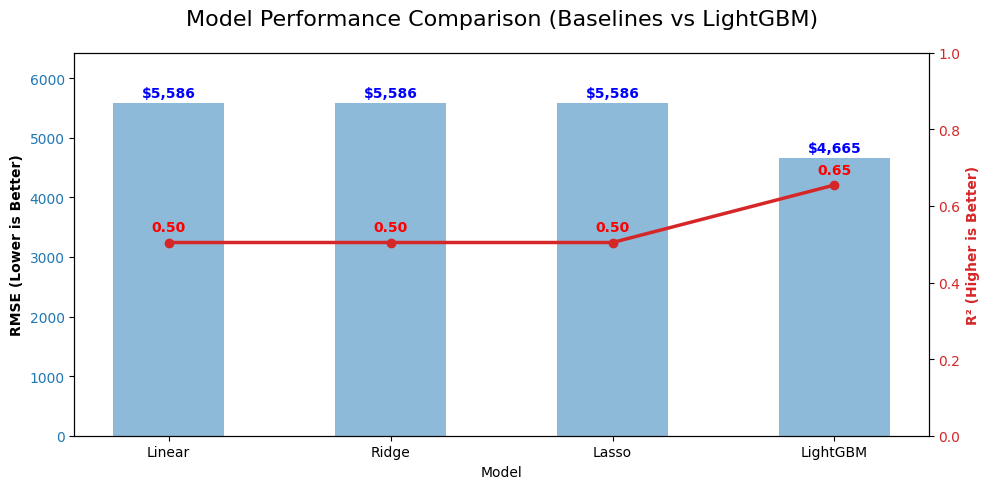
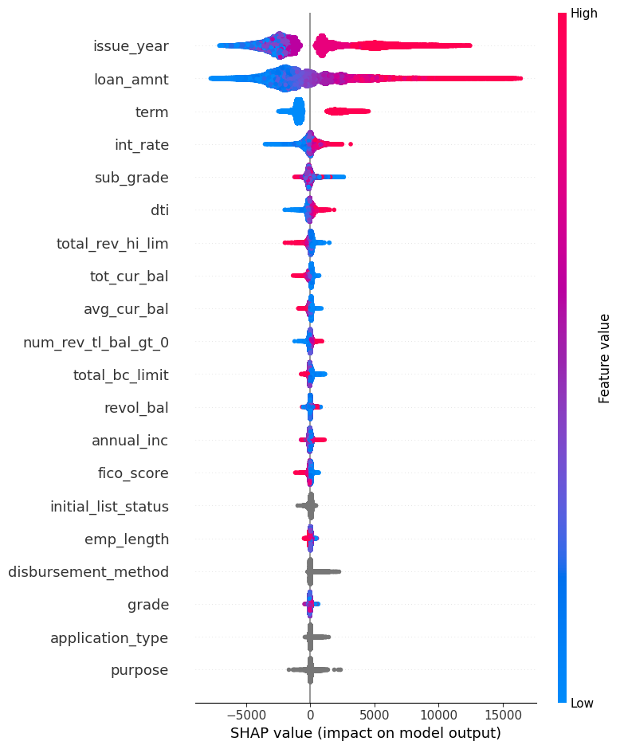
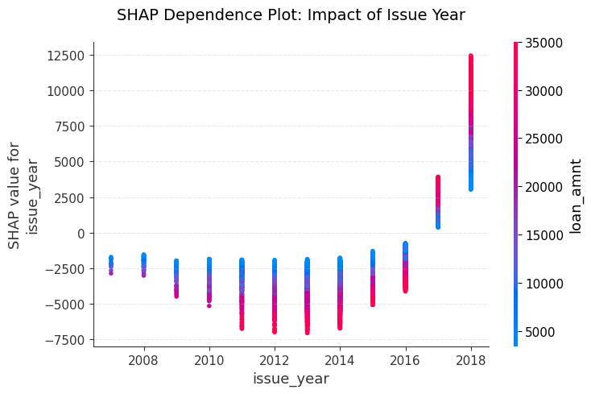
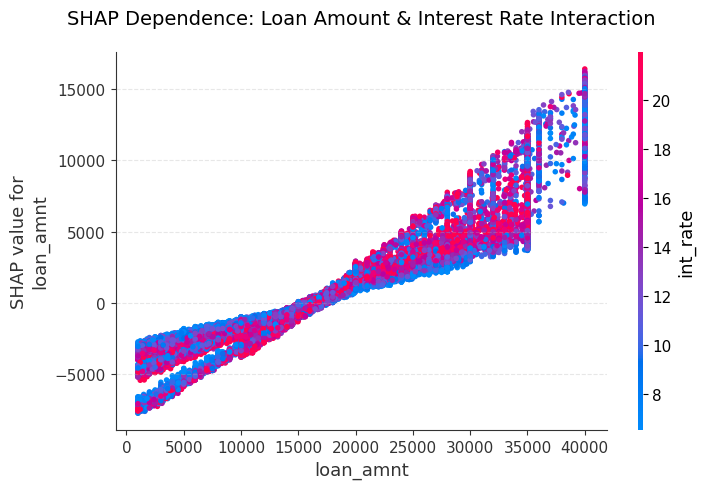
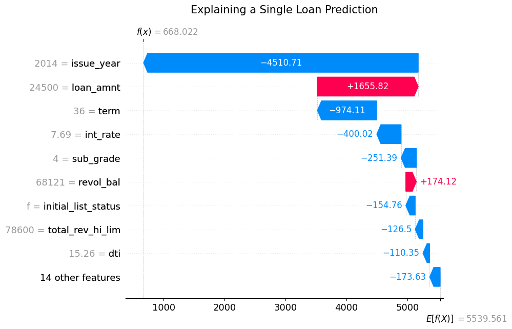

### LoanIQ Loss Predictor

**Aravind Sasidharan**

#### Executive summary
The project aims to predict the expected financial loss on a loan, based on borrower attributes, loan characteristics, and credit behaviour in the historical Lending Club dataset. The focus is on building an explainable model that helps lenders understand which factors most strongly influence credit risk and how these factors affect expected loss.

The primary target is the expected loss. Although the modelling framework could be extended to a classification problem to predict the probability of default,
modelling the loss_amount provides the severity of the projected loss which is more actionable for lending decisions.

#### Rationale
Banks and lenders process thousands of loan applications every day, and even a small improvement in predicting default risk can make a major difference to the bottom line. The challenge is not just knowing which borrowers are risky, but also in understanding what specific factors drive that risk.

This model helps lenders:
* **Identify high-risk loans early:** Estimate the likelihood of loss before a lending decision is made.
* **Interpret risk clearly:** Rather than replacing human judgment, the model flags combinations of features (e.g., DTI and Loan Term) that signal a higher chance of default.
* **Improve transparency:** Automating parts of the risk assessment process through explainable machine learning reduces reliance on static rules and manual assessments.

#### Research Question
Can machine learning regression models predict the loss severity of a loan at origination, based on historical Lending Club data? And which borrower or loan factors have the biggest impact on that risk?

#### Data Sources
* [Lending Club dataset on Kaggle](https://www.kaggle.com/datasets/wordsforthewise/lending-club)
* The dataset contains millions of records from 2007-2018. 
* To facilitate structured analysis, the [Lending Club Data Dictionary](https://github.com/aravSpark/berkeley-ml-capstone/blob/main/data/lending_club_data_dictionary.xlsx) was enriched with an EDA Category column to systematically map 150+ variables into categories Pre-issuance, Candidate Features, Post-Issuance and Identifiers.
* Post-issuance features were removed to prevent data leakage and ensure real-world applicability at the point of loan application.

#### Methodology
To build and test the model, the project used the following approach:

* **Preprocessing:** Cleaned 150+ variables and utilised native categorical handling for high-cardinality features.
* **Baseline Modeling:** Linear, Ridge, and Lasso regression models to define a performance floor.
* **Advanced Modeling:** LightGBM to capture non-linear relationships and feature interactions. LightGBM was selected because it handles large datasets efficiently, captures complex, non-linear patterns and natively supports categorical features through encoding.
* **Optimization:** HalvingGridSearchCV (Successive Halving) for efficient hyperparameter tuning.
* **Explainability:** SHAP values to decode model logic and identify key risk drivers.

**Evaluation Metrics:**

Models were evaluated using:

* **RMSE (Root Mean Squared Error):** Prioritized to penalize large-scale prediction errors, which are more relevant to a lender than small average misses.
* **MAE (Mean Absolute Error):** Used for direct dollar-value error interpretation.
* **R² Score:** Used to measure the proportion of variance explained by the model.

#### Results

The baseline linear models (Linear Regression, Ridge, and Lasso) showed almost identical performance:
* **RMSE:** ~$5,585 | **MAE:** ~$4,054 | **R²:** ~0.50

LightGBM Model (Final) achieved substantially improved performance:
* **RMSE:** ~$4,626 (17% reduction)
* **MAE:** ~$2,808 (30% reduction)
* **R²:** ~0.66 (16% absolute increase)

This meaningful improvement over linear baselines indicated that loan loss severity was governed by non-linear effects and feature interactions such as the compounding risk of high interest rates on large principal amounts.

**Model Selection**: 

Hyperparameter tuning on a 200k subset suggested a simpler model, but validation on the full 2M-row dataset confirmed that the higher-capacity initial model (800 trees, 63 leaves) was superior for capturing deep risk patterns without overfitting.

#### Model Explainability

To ensure interpretability, the final model was analysed using SHAP (SHapley Additive exPlanations):

* Global SHAP importance identified Issue Year as the primary driver of the model's predictions, followed by loan amount, term, and interest rate.
* The high importance of Issue Year suggests that macroeconomic factors surrounding the time of loan origination have the most significant impact on loss outcomes.
* Exposure-related features (Loan Amount, Term) have a significantly higher impact on loss severity than traditional borrower metrics (Income, FICO score, DTI).
* The model demonstrates extreme sensitivity to the Issue Year of the loan, indicating that the period in which the loan was issued is more predictive of loss than individual credit characteristics.

The SHAP summary plot confirms that Issue Year and Loan Amount are the primary drivers of the model's predictions. For these features, high values (red) representing more recent years and larger loan quantities push predictions toward significantly higher expected losses.

**Compounding of Risks**

The interaction between Issue Year and Loan Amount was analysed to understand the model's sensitivity. 

The dependence plot confirms a compounding of risks. Recently issued loans generally show higher expected losses, this risk is significantly higher for large loans issued in those years. This suggests that the model is identifying specific vulnerabilities in large-scale lending during recent economic cycles.

**Cost of Large Loans**

Beyond time of issuance, analyzing the relationship between Loan Amount and Interest Rate revealed that while large loans are naturally riskier, the Interest Rate acts as a risk multiplier.

High interest rates (red dots) significantly increase the risk. A large loan with a high interest rate is viewed by the model as far more riskier than a large loan with a low rate.

**Model Transparency**

SHAP Waterfall Plot was used to decode a single prediction and demonstrate model transparency at the borrower level, 

This chart illustrates how the model balances conflicting signals. In this instance, a large loan amount pushed the risk up but the model significantly lowered the final predicted loss because the loan belonged to a safer year (2014). This level of detail provides the reasons necessary for decision support.

**Key Findings:**

* Loan size and term are dominant drivers, but their impact is non-linear. SHAP interaction analysis confirms that high interest rates act as a risk multiplier on large-principal loans.
* Income and DTI have limited direct influence on loss severity once the loan structure is accounted for.
* The significance of Issue Year represents 'Vintage Risk', where the macroeconomic environment at origination outweighs individual credit scores.
* Non-linear models significantly outperform linear baselines in explaining loss variation.

**Recommendations:**
* Implement enhanced due diligence for loans exceeding specific principal thresholds or terms, as these represent the highest severity risks.
* Apply tiered exposure limits based on loan size and interest rates, establish stricter caps for high-interest-rate categories to mitigate compounding of loss severity.
* Given the superior predictive power (16% R² increase), gradient-boosted models like LightGBM should be prioritized over linear models for production-level loss forecasting.

**Limitations and Next Steps**

* The model predicts loss severity but does not explicitly model probability of default.
* Post-origination borrower behaviour is not available at application time, limiting predictive power.
* Future enhancements could include a joint Probability of default and Loss given default model.
* Transition from using Issue Year as a proxy for macroeconomic indicators and directly incorporate macroeconomic factors.

#### Outline of project

- [Jupyter Notebook (Google Colab)](https://colab.research.google.com/drive/1_WKRP-RW_4Ti_xzVVe8DS-6fH2WW1WSU?usp=sharing)
- [Jupyter Notebook (Static Github version)](https://github.com/aravSpark/berkeley-ml-capstone/blob/main/LoanIQ.ipynb) 

##### Contact and Further Information

Aravind Sasidharan
